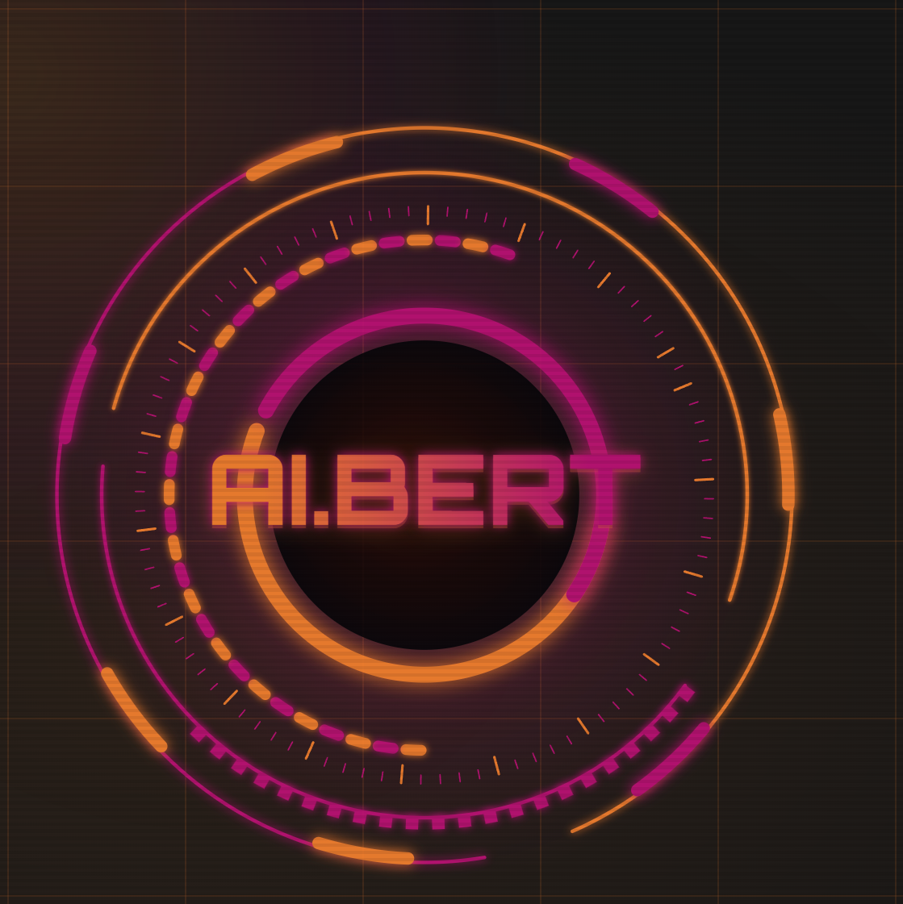

<div align="center">

# AI.BERT



### *Asistente Inteligente para la Gestión Académica Universitaria*

[](.)
[](.)
[](.)

</div>

---

# Índice

- [Descripción general](#descripción-general)
- [Público objetivo](#público-objetivo)
- [Manual de identidad visual](#manual-de-identidad-visual)
- [Arquitectura frontend](#arquitectura-frontend)
- [Diseño UI/UX](#diseño-uiux)
- [Accesibilidad](#accesibilidad)
- [Mockups y prototipos](#mockups-y-prototipos)
- [Flujo de usuario](#flujo-de-usuario)
- [Demo](#demo-del-módulo)
- [Recursos](#recursos)

---

# Descripción General

## Resumen del proyecto

**AI.BERT** es una plataforma web inteligente diseñada para acompañar al estudiante universitario a lo largo de su semestre académico. Combina gestión de materias, seguimiento de notas, organización de tareas y análisis de rendimiento en un solo lugar, potenciado por inteligencia artificial.

- **Problema que resuelve:** los estudiantes carecen de una herramienta centralizada para planificar, hacer seguimiento académico y recibir orientación personalizada durante el semestre.
- **Experiencia que ofrece:** una interfaz intuitiva que permite planificar la semana, simular calificaciones finales, recibir recomendaciones con IA y mantenerse motivado mediante gamificación.
- **Alcance del frontend:** autenticación, perfil académico, gestión de materias y notas, tareas, estadísticas, recomendaciones con IA y módulo social.

## Objetivos

### Objetivo general

Proveer una interfaz web inteligente y accesible que centralice la gestión académica del estudiante universitario, apoyada por inteligencia artificial.

### Objetivos específicos

- Implementar una experiencia de usuario fluida para el seguimiento de notas, tareas y rendimiento académico.
- Integrar módulos de inteligencia artificial para priorización de tareas, recomendaciones personalizadas y alertas de rendimiento.
- Incluir un sistema de gamificación que motive al estudiante a mantener sus hábitos académicos.

---

# Público Objetivo

- **Usuarios objetivo:** estudiantes universitarios activos que cursan múltiples materias por semestre.
- **Necesidades:** centralizar información académica, organizar tiempos de estudio, anticipar riesgos de bajo rendimiento y colaborar con compañeros.
- **Perfil:** estudiante de pregrado con acceso a dispositivos con navegador web, acostumbrado a herramientas digitales.

**Casos de uso principales:**

| # | Pantalla | Descripción | Rol |
|---|----------|-------------|-----|
| 1 | Registro | Creación de cuenta de usuario | Público |
| 2 | Inicio de sesión | Autenticación con credenciales | Público |
| 3 | Perfil académico | Configuración de datos académicos | Estudiante |
| 4 | Editar perfil | Actualización de datos personales | Estudiante |
| 5 | Resumen académico | Vista general del semestre | Estudiante |
| 6 | Mis materias | Registro y gestión de materias | Estudiante |
| 7 | Estructura de evaluación | Definición de cortes y porcentajes | Estudiante |
| 8 | Registro de notas | Ingreso de calificaciones | Estudiante |
| 9 | Ver / Editar notas | Consulta y corrección de notas | Estudiante |
| 10 | Simulador de notas | Simulación de nota objetivo | Estudiante |
| 11 | Crear tarea | Registro de tareas con fecha y materia | Estudiante |
| 12 | Kanban / Calendario | Vista visual de tareas | Estudiante |
| 13 | Plan semanal | Organización y distribución automática | Estudiante |
| 14 | Priorización IA | Motor de priorización con IA | Estudiante |
| 15 | Dashboard | Estadísticas académicas generales | Estudiante |
| 16 | Detalle por materia | Evolución y rendimiento por materia | Estudiante |
| 17 | Alertas | Notificaciones de sobrecarga o bajo rendimiento | Estudiante |
| 18 | Sugerencia del día | Qué estudiar hoy según estadísticas | Estudiante |
| 19 | Recomendaciones | Sugerencias personalizadas con IA | Estudiante |
| 20 | Gamificación | Puntos, logros y progreso académico | Estudiante |
| 21 | Invitar amigos | Envío de invitaciones a la plataforma | Estudiante |
| 22 | Disponibilidad | Compartir horario con amigos | Estudiante |
| 23 | Sesión de estudio | Creación y unión a sesiones colaborativas | Estudiante |

---

# Manual de Identidad Visual

## Logotipo


> _(Agregar explicación conceptual del logo y sus variantes si existen)_

---

## Paleta de Colores

| Uso | Color | HEX |
|-----|-------|-----|
| Primario | _(en construcción)_ | `#` |
| Secundario | _(en construcción)_ | `#` |
| Acento | _(en construcción)_ | `#` |
| Fondo | _(en construcción)_ | `#` |
| Texto | _(en construcción)_ | `#` |

> ⚠️ Paleta en definición — completar con los colores finales del sistema de diseño.

**Modelos de referencia visual:**
- **Duolingo** — sistema de gamificación y motivación del estudiante.
- **Google Classroom** — flujo académico y seguimiento de materias.

---

## Tipografía

> _(Agregar fuentes principales, secundarias y jerarquía tipográfica según el sistema de diseño definido)_

| Elemento | Fuente | Tamaño |
|----------|--------|--------|
| Título (H1) | _(por definir)_ | _(por definir)_ |
| Subtítulo (H2) | _(por definir)_ | _(por definir)_ |
| Texto general | _(por definir)_ | _(por definir)_ |
| Botones | _(por definir)_ | _(por definir)_ |

---

# Diseño UI/UX

## Principios de diseño

- **Consistencia:** sistema visual uniforme en toda la plataforma.
- **Jerarquía visual:** énfasis en la información académica más crítica (notas, tareas próximas, alertas).
- **Navegación intuitiva:** flujos claros entre módulos académicos, de tareas y sociales.
- **Diseño responsive:** adaptable a distintos tamaños de pantalla.
- **Retroalimentación al usuario:** estados visuales claros en componentes interactivos (hover, loading, éxito, error).

---

## Componentes UI

| Componente | Descripción | Uso |
|-----------|-------------|-----|
| Navbar | Barra de navegación principal | Global |
| Botones | Primario, secundario, alerta | Acciones |
| Cards | Tarjetas de materias, tareas y logros | Listados |
| Formularios | Registro, login, ingreso de notas | Entrada de datos |
| Modales | Confirmaciones y detalles rápidos | Acciones contextuales |
| Kanban | Tablero de tareas por estado | Gestión de tareas |
| Calendario | Vista de entregas y eventos | Planificación |
| Dashboard / Gráficas | Estadísticas académicas | Análisis de rendimiento |
| Badges / Logros | Íconos de gamificación | Módulo motivacional |
| Alertas | Notificaciones de riesgo y sobrecarga | Inteligencia académica |

---

## Sistema de diseño

> _(Agregar reglas de espaciado, iconografía, guía de estados y guidelines de componentes una vez definidos en Figma)_

---

# Arquitectura Frontend

## Estructura del proyecto

```bash
src/
├── components/       # Componentes reutilizables (Navbar, Cards, Modales, etc.)
├── pages/            # Vistas por módulo (auth, materias, tareas, stats, social)
├── hooks/            # Custom hooks (auth, notas, tareas, IA)
├── services/         # Integración con la API REST del backend
├── assets/           # Imágenes, íconos, fuentes
└── routes/           # Configuración de rutas protegidas
```

## Tecnologías

| Área | Stack |
|------|-------|
| Framework | React |
| UI Library | _(por definir)_ |
| Estado | _(por definir)_ |
| Routing | _(por definir)_ |
| Testing | _(por definir)_ |

---

# Funcionalidades

### Autenticación y perfil
- Registro con validación de correo
- Inicio de sesión con JWT
- Configuración y edición de perfil académico

### Gestión académica
- Registro de materias con horario y docente
- Definición de cortes de evaluación con porcentajes
- Ingreso, consulta y edición de calificaciones
- Simulador de nota objetivo por materia

### Gestión de tareas
- Creación de tareas asociadas a materias
- Vista Kanban y Calendario
- Priorización automática con IA
- Balanceador de carga semanal y rebalanceo dinámico

### Estadísticas e inteligencia
- Dashboard de rendimiento académico general
- Evolución de notas por materia
- Alertas de sobrecarga y bajo rendimiento
- Recomendaciones personalizadas con IA
- Sugerencia diaria de qué estudiar

### Gamificación
- Sistema de puntos por actividad completada
- Logros y badges académicos
- Seguimiento de progreso motivacional

### Módulo social
- Invitación de amigos a la plataforma
- Compartir disponibilidad semanal
- Creación y unión a sesiones de estudio colaborativo

---

# Accesibilidad

- **Contrastes:** relación de contraste mínima 4.5:1 para texto sobre fondo (WCAG AA).
- **Daltonismo:** la diferenciación de estados no depende únicamente del color; se complementa con íconos y etiquetas de texto.
- **Navegación:** estructura semántica HTML con soporte para navegación por teclado y landmarks ARIA.
- **Tipografía legible:** tamaños mínimos adecuados para texto de cuerpo; fuentes con buena legibilidad en pantalla.
- **Buenas prácticas WCAG:** estados de foco visibles, textos alternativos en imágenes y componentes interactivos correctamente etiquetados.

---

# Mockups y Prototipos

## Wireframes

> 📎 _(Agregar link o imágenes de wireframes)_

## Mockups de alta fidelidad

> 📎 _(Agregar link a Figma u otra herramienta)_

## Prototipo navegable

> 📎 _(Agregar link al prototipo interactivo)_

---

# Flujo de Usuario

## Registro y autenticación
1. El usuario accede a la plataforma → pantalla de **Registro**.
2. Valida su correo y accede a **Inicio de sesión**.
3. Completa su **Perfil académico**.

## Flujo académico principal
1. Desde el **Resumen académico** visualiza el estado general del semestre.
2. Registra **materias** y define la **estructura de evaluación**.
3. Ingresa y consulta **notas**; usa el **Simulador** para proyectar resultados.

## Flujo de tareas
1. Crea tareas en **Crear tarea** asociadas a sus materias.
2. Las organiza en el **Kanban / Calendario** y el **Plan semanal**.
3. La IA prioriza automáticamente según carga y urgencia.

## Inteligencia y gamificación
1. El **Dashboard** muestra estadísticas y evolución de rendimiento.
2. Las **Alertas** y **Recomendaciones** orientan al estudiante en tiempo real.
3. La **Gamificación** registra logros y puntos por actividad completada.

## Módulo social
1. El estudiante **invita amigos** a la plataforma.
2. Comparte su **disponibilidad** y se une a **sesiones de estudio** colaborativas.

> _(Agregar diagrama de navegación entre pantallas cuando esté disponible)_

---

# Demo del Módulo

- **URL de despliegue:** `https://aibert.app` *(en construcción — próximamente disponible)*

> _(Agregar capturas de pantalla, GIFs del flujo o video demostración cuando estén disponibles)_

---

# Recursos

## Assets visuales
- `doc/imagenes/` — imágenes y capturas del sistema
- _(Agregar carpeta de íconos y mockups exportados)_

## Documentación adicional
- _(Agregar link a documentación UI)_
- _(Agregar link a documentación UX / Figma)_

## Referencias bibliográficas

> _(Agregar referencias utilizadas para el diseño y desarrollo)_

---

## Historial de Revisión

| Versión | Fecha | Descripción | Autor |
|---------|-------|-------------|-------|
| 1.0.0 | 2026-04-30 | Creación inicial del README | Equipo AI.BERT |
| 1.1.0 | _(por completar)_ | Adaptación a plantilla FRONT.md | Equipo AI.BERT |

---

<div align="center">
  <sub>AI.BERT · Asistente Inteligente para la Gestión Académica · DOSW 2026-1</sub>
</div>